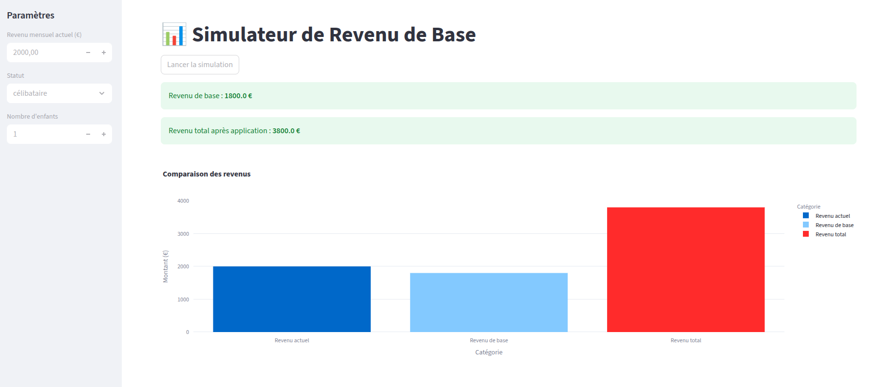

<!--
© 2025 Mouvement Français pour un Revenu de Base http://www.revenudebase.info

SPDX-License-Identifier: CC-BY-SA-4.0+
SPDX-FileContributor:    Fabien FURFARO
-->

# Simulateur de Revenu de Base

[](https://github.com/fabienfrfr/TRU)
[](https://codeberg.org/fabienfrfr/Ton-Revenu-Universel)

Un simulateur web pour calculer l'impact d'un revenu de base sur les revenus des ménages, inspiré par les propositions politiques actuelles. Le projet utilise **FastAPI** pour le backend, **Streamlit** pour le frontend, et **pytest-bdd** pour les tests.



---

## 📌 Fonctionnalités

- **Calcul du revenu de base** selon le statut (célibataire, en couple) et le nombre d'enfants.
- **Visualisation interactive** des résultats avec des graphiques comparatifs (barres, camembert).
- **Base de données SQL** pour stocker les simulations.
- **Tests BDD** avec `pytest-bdd` pour la validation des scénarios.
- **Déploiement automatisé** via GitHub Actions et Docker.

---

## 🛠 Prérequis

### 1. Pour le faire tourner

- Un shell POSIX. N'importe lequel.
- [GnuMake](https://www.gnu.org/software/make/)
- [Docker](https://docs.docker.com/get-docker/)
- [Docker Compose](https://docs.docker.com/compose/install/)
- Une instance de [Traefik](https://hub.docker.com/_/traefik) déjà configurée et fonctionnelle.

### 2. Pour le développement

Il faudra en plus :

- [Git](https://git-scm.com/)
- [Python 3.9+](https://www.python.org/downloads/)
- [Pytest](https://docs.pytest.org/)
- [Pylint](https://www.pylint.org/)
- [Mypy](https://www.mypy-lang.org/)
- [Reuse](https://reuse.software/)
- [Shellcheck](https://www.shellcheck.net/)
- [Bats](https://bats-core.readthedocs.io/)
- [Reqflow](https://goeb.github.io/reqflow/)
- [Tappy](https://tappy.readthedocs.io/en/latest/)

For debian like distribution do :

```bash
sudo apt install git reuse shellcheck bats tappy
sudo apt install build-essetial automake
sudo apt install libzip-dev libxml2-dev libpoppler-cpp-dev libpcre3-dev
git clone https://github.com/goeb/reqflow.git
cd reqflow
./configure
make
sudo make install
```

### 3. Pour générer la doc aux formats PDF et HTML

- [Asciidoctor](https://asciidoctor.org/)
- [Asciidoctor-pdf](https://docs.asciidoctor.org/pdf-converter/latest/)
- [Asciidoctor-diagram](https://docs.asciidoctor.org/diagram-extension/latest/)

For debian like distribution do :

```bash
sudo apt install asciidoctor ruby-asciidoctor-pdf
sudo gem install asciidoctor-diagram asciidoctor-diagram-ditaamini
```

---

## 🚀 Installation et Lancement

### 1. Cloner le dépôt

```bash
git clone https://github.com/ffurfaro/simulateur_revenu_de_base.git
cd simulateur_revenu_de_base
```

### 2. Configuration

Créez le fichier de paramétrage par défaut :

```bash
make .env
```
Puis éditez le fichier .env pour adapter a vos besoins.

Principalement le nom de domaine du projet.

Le nom du network docker externe sur lequel traefik écoute.

Et potentiellement le nom de l'instance pour éviter d'avoir plusieurs
instance du même nom si vous en lancez en parallèle sur le même serveur.

Ensuite soit vous disposez d'un enregistrement DNS correspondant a votre config.
Soit vous mettez un alias dans le fichier /etc/hosts de toutes le machine
avec lesquels vous voulez accéder au site.

```
IP_DU_SERVEUR    nom.de.domaine.du.service
```

### 3. Lancer avec Docker Compose

```bash
make start
```

- Le **frontend Streamlit** sera disponible sur http://nom.de.domaine.du.service
- La **documentation FastAPI** sera disponible sur http://backend.nom.de.domaine.du.service

En cas de problème de `CacheConfigs` :

```bash
docker-compose down --volumes --rmi all --remove-orphans
docker builder prune -f
docker system prune --volumes -f
```

#### En mode test

```bash
docker network create traefik
make test_mode_start
```


### 4. Développement local (sans Docker)

#### Backend

```bash
cd backend
python -m venv venv
source venv/bin/activate  # Linux/Mac
# ou `venv\Scripts\activate` sur Windows
pip install -r requirements.txt
uvicorn app.main:app --reload
```

#### Frontend

```bash
cd frontend
python -m venv venv
source venv/bin/activate
pip install -r requirements.txt
streamlit run app.py
```

---

## 🧪 Tests

### Lancer les tests BDD

```bash
cd backend
pytest
```

- Les scénarios BDD sont définis dans `backend/tests/features/`.
- Les étapes de test sont implémentées dans `backend/tests/steps/`.

---

## 📦 Déploiement

### 1. Déploiement local avec Docker Compose

```bash
docker-compose up --build
```

### 2. Déploiement sur un serveur/VM

1. **Configurer les variables d'environnement** (par exemple, `DATABASE_URL`).
2. **Déployer avec Docker Compose** sur ta VM :
   ```bash
   scp docker-compose.yml user@ton-serveur:/chemin/vers/le/projet
   ssh user@ton-serveur
   cd /chemin/vers/le/projet
   docker-compose up -d
   ```
3. **Configurer un reverse proxy** (Nginx, Traefik) pour exposer les ports 80/443.

### 3. CI/CD avec GitHub Actions

- Le workflow `.github/workflows/ci-cd.yml` est configuré pour :
  - Lancer les tests à chaque push/PR.
  - Construire et pousser les images Docker sur Docker Hub.
- **Variables secrètes** :
  - `DOCKER_USERNAME` : Identifiant Docker Hub.
  - `DOCKER_PASSWORD` : Mot de passe ou token Docker Hub.

---

## 📂 Structure du Projet

```
simulateur_revenu_de_base/
│
├── backend/
│   ├── app/
│   │   ├── __init__.py
│   │   ├── main.py          # FastAPI app
│   │   ├── models.py        # Modèles SQLAlchemy
│   │   ├── schemas.py       # Schémas Pydantic
│   │   ├── crud.py          # Logique CRUD
│   │   └── database.py      # Configuration de la base de données
│   ├── tests/
│   │   ├── features/        # Fichiers BDD (Gherkin)
│   │   └── steps/           # Étapes pytest-bdd
│   ├── requirements.txt
│   └── Dockerfile
│
├── frontend/
│   ├── app.py               # Streamlit app
│   └── Dockerfile
|
├── tests/
│   ├── unit/                # Tests unitaires/BDD pour le backend
│   │   ├── features/
│   │   └── steps/
│   ├── e2e/                 # Tests end-to-end (frontend + backend)
│   │   ├── test_simulation.py
│   │   └── conftest.py
│   └── requirements.txt     # Dépendances spécifiques aux tests
|
├── .github/
│   └── workflows/
│       └── ci-cd.yml        # GitHub Actions pour CI/CD
│
├── docker-compose.yml
|
└── README.md
```

---

## 🔧 Configuration

### Variables d'environnement

| Variable          | Description                          | Exemple de valeur                     |
|-------------------|--------------------------------------|---------------------------------------|
| `DATABASE_URL`    | URL de la base de données PostgreSQL | `postgresql://user:pass@db:5432/db`   |

---

## 📊 Exemples de Visualisations

### 1. Comparaison des revenus (graphique en barres)
 *(TODO)*

### 2. Répartition des revenus (graphique camembert)
 *(TODO)*

---

## 🤝 Contribuer

Les contributions sont les bienvenues ! Voici comment contribuer :

1. **Fork** le dépôt.
2. Crée une **branche** pour ta fonctionnalité (`git checkout -b ma-nouvelle-fonctionnalite`).
3. **Commit** tes changements (`git commit -am 'Ajout d'une nouvelle fonctionnalité'`).
4. **Push** la branche (`git push origin ma-nouvelle-fonctionnalite`).
5. Ouvre une **Pull Request**.

---

## 📜 Licence

Ce projet est sous licence **MIT**. Voir le fichier [LICENSE](LICENSE) pour plus de détails.

---

## 📬 Contact

Pour toute question ou suggestion, contacte-moi à [fabien.furfaro@gmail.com](mailto:fabien.furfaro@gmail.com).
