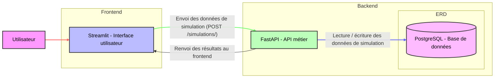

## Architecture fonctionnelle

Inclu les éléments techniques

```mermaid

graph LR

  User[Utilisateur] --> FE[Streamlit - Interface utilisateur]
  subgraph Frontend
    FE
  end
  subgraph Backend
    BE[FastAPI - API métier]
    subgraph ERD
      DB[(PostgreSQL - Base de données)]
    end
  end
  FE -- Envoi des données de simulation (POST /simulations/) --> BE
  BE -- Lecture / écriture des données de simulation --> DB
  BE -- Renvoi des résultats au frontend --> FE

 

  style User fill:#f9f,stroke:#333,stroke-width:2px,color:#000
  style FE fill:#bbf,stroke:#333,stroke-width:2px,color:#000
  style BE fill:#bfb,stroke:#333,stroke-width:2px,color:#000
  style DB fill:#fbf,stroke:#333,stroke-width:2px,color:#000

  linkStyle 0 stroke:#f66,stroke-width:2px
  linkStyle 1 stroke:#6f6,stroke-width:2px
  linkStyle 2 stroke:#66f,stroke-width:2px

 

```

 