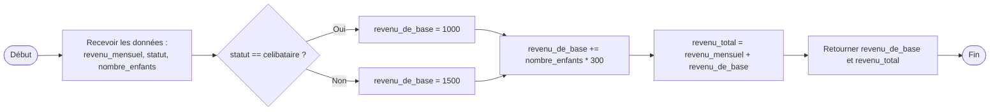
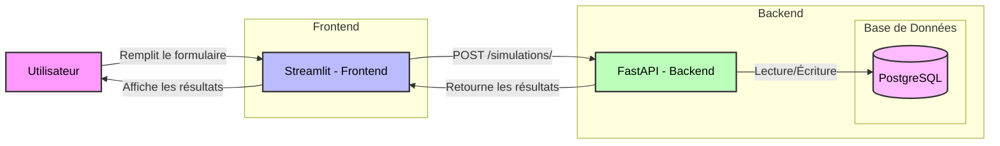
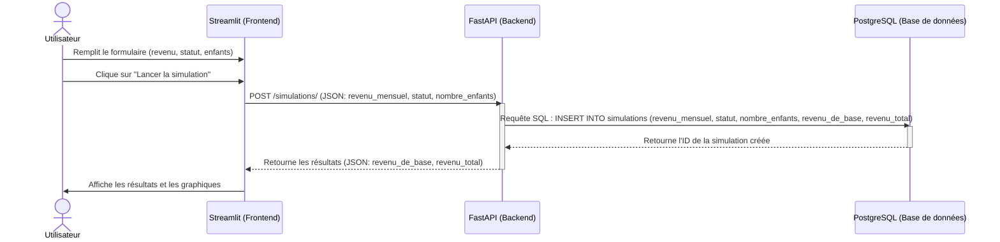

<!--
© 2025 Mouvement Français pour un Revenu de Base http://www.revenudebase.info

SPDX-License-Identifier: CC-BY-SA-4.0+
SPDX-FileContributor:    Fabien FURFARO
-->

# **📂 Architecture Technique du Simulateur de Revenu de Base**

## 🔧 Composant principaux

###  Calcul du Revenu de Base et du Revenu Total

## **🔄 Flux de Données**

### **1. Diagramme d'Architecture Globale**

---

### **2. Diagramme de Séquence : Simulation d'un Revenu de Base**
